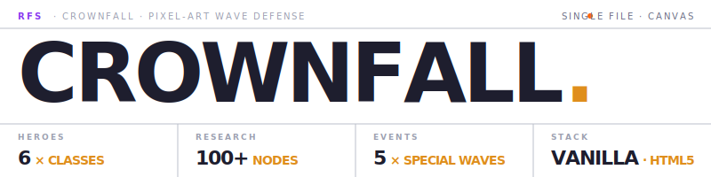

<div align="center">

<picture>
  <source media="(prefers-color-scheme: dark)" srcset="docs/assets/logo-dark.svg" />
  
</picture>

# Crownfall

A pixel-art medieval wave-defense incremental game in a single HTML file.

[](https://github.com/Real-Fruit-Snacks/Crownfall/releases)
[](LICENSE)

</div>

## Overview

Crownfall is a top-down medieval incremental wave-defense game. You command a row of heroes on a stone wall while progressively tougher waves attack from the right. Every death is meaningful — bank Research Points and Crowns to permanently upgrade your fortress, unlock new heroes, elements, skills, hazards, and skins. Hundreds of runs of progression by design.

The entire game lives in a single self-contained `index.html` (~7,500 lines including CSS and JS). HTML5 Canvas with `image-rendering: pixelated`. Web Audio API generates every sound from scratch — no audio files. localStorage for saves.

▶ **[Play on GitHub Pages](https://Real-Fruit-Snacks.github.io/Crownfall/)**

## Key Features

- **6 Hero Classes**: Archer, Crossbow, Cannoneer, Mage, Cleric, and Bard.
- **6 Enemy Archetypes**: Goblins, Chargers, Shieldbearers, Archers, Healers, and Witches (plus boss variants).
- **8 Weapon Imbuements**: Fire, Ice, Poison, Bleed, Knockback, Stun, Holy, Mending, and Hex.
- **Deep Progression**: Banked Research Points (100+ nodes) and Crowns (late-game power spikes).
- **Events & Hazards**: 5 special waves (e.g. Blood Moon, Goblin Horde) and 5 deployable field hazards.
- **Zero Dependencies**: Pure HTML5 Canvas and Web Audio API inside a single HTML file. No build pipeline.

## Getting Started / Installation

Because Crownfall is entirely contained within a single file, there are no dependencies to install or build steps to run.

```bash
# Clone the repository
git clone https://github.com/Real-Fruit-Snacks/Crownfall.git
cd Crownfall

# Open the file directly in your browser
# macOS:
open index.html
# Windows:
start index.html
# Linux:
xdg-open index.html
```

Or run a tiny static server (recommended for cleaner cache and audio behavior):

```bash
python -m http.server 5555
# then visit http://localhost:5555
```

## Usage

**Controls:**
- **Click**: Buy slot, hire hero, collect coin, tap-damage enemy.
- **1–4**: Cast / arm skill in slot N.
- **Q**: End run (banks RP, opens research).
- **R**: Toggle research book.
- **M**: Mute sound.
- **Space**: Pause / resume.
- **Esc**: Close topmost menu / unarm skill / dismiss popup.

**Progression Mechanics:**
Research Points are banked at the end of each run and spent in the Research Book. Crowns drop from bosses and unlock late-game power spikes and 12 hero skin variants.

## Architecture / File Structure

```text
Crownfall/
├── index.html              # The complete game (HTML, CSS, JS, Assets)
├── docs/                   # GitHub Pages assets
│   └── assets/             # Logos for the README
├── pack-for-itch.bat       # Script to compress the game for Itch.io distribution
└── README.md               # Project documentation
```

**Technical Stack:**
- **Render**: HTML5 Canvas 2D with `image-rendering: pixelated`. All art drawn from primitives.
- **Audio**: Web Audio API (synth-generated SFX and looping medieval ambient). No asset files.
- **State**: Vanilla JavaScript (no framework, no bundler, no transpiler).
- **Saves**: `localStorage` handles research, crowns, stats, achievements, commanders, and settings.
- **Chrome**: CSS-only chunky pixel-art borders via `box-shadow inset`.

## Contributing

Review the contribution guidelines in [CONTRIBUTING.md](CONTRIBUTING.md) before submitting pull requests.

## License

This project is licensed under the MIT License. See [LICENSE](LICENSE) for details.
